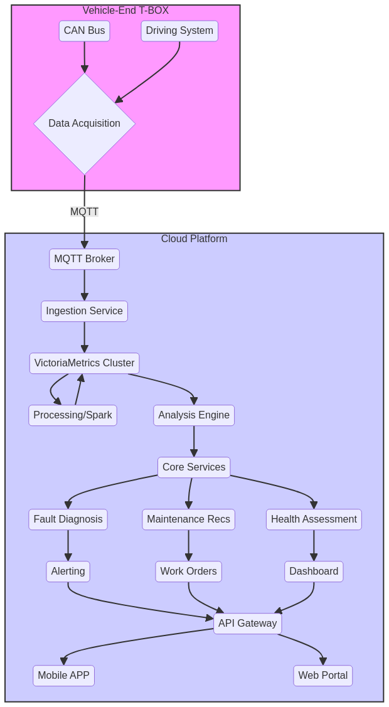

# 油电混动无人拖拉机预测性维护商业化方案

**版本**: 2.0
**作者**: Manus AI
**日期**: 2025年10月29日

## 1. 执行摘要

随着精准农业和智慧农业的快速发展，无人农机设备的可靠性、出勤率和维护效率成为制约其大规模商业化落地的关键因素。传统的被动式维修（故障后维修）和计划性维修已无法满足现代农业对高效率、低成本运营的需求。本项目旨在设计一套高质量、可商业化落地的预测性维护（Predictive Maintenance, PdM）系统，通过对拖拉机运行数据进行实时监控和深度分析，实现对关键部件故障的提前预测、健康状态的精准评估和智能化维保决策，从而最大化设备可用性、降低非计划停机时间，并优化维护资源配置。

本方案提出了一套基于**VictoriaMetrics**和**Nixtla TimeGPT**等先进开源技术的油电混动无人拖拉机预测性维护系统。通过云-边协同架构和多层次分析引擎，系统能够实现从数据采集、存储、分析到决策支持的全流程闭环。该方案不仅技术上可行，而且充分考虑了商业化落地的需求，有望为智慧农业领域带来显著的经济效益和运营效率。

## 2. 核心需求分析

根据用户提供的《油电混动无人拖拉机智能驾驶系统v4.0.pdf》文档及行业最佳实践，本预测性维护系统的核心需求如下：

- **实时数据采集**: 能够通过车载T-BOX模块，全面、实时地采集车辆底层CAN总线数据、智驾系统状态、传感器健康度及故障日志。
- **海量数据存储**: 构建能够支撑大规模车队（数千台级别）数据并发写入、高效存储和快速查询的时序数据湖。
- **多层次分析能力**: 具备从实时告警、短期监控到中长期健康趋势预测的多层次、多维度智能分析能力。
- **精准故障预测**: 能够提前识别出发动机、电池、变速箱、液压系统等核心部件的潜在故障模式。
- **智能化决策支持**: 提供清晰的设备健康度评分、剩余使用寿命（RUL）预测，并生成具体的维护建议和工单。
- **友好人机交互**: 通过移动APP和Web端，为远程操作员、车队经理和维修工程师提供直观的数据可视化、智能告警和工单管理功能。
- **高可靠性与可扩展性**: 系统架构需具备高可用性，并能随着车队规模的增长而水平扩展。

## 3. 系统总体架构

基于上述需求，并根据用户最新指示采用**VictoriaMetrics**作为核心时序数据库，我们设计了如下的云-边协同预测性维护系统架构。该架构分为车端（T-BOX）、云端平台和用户交互三层。

### 3.1. 车端（T-BOX）

车端是数据采集和边缘计算的起点，负责从车辆的各个子系统中收集原始数据，并进行初步处理和实时响应。

- **数据采集模块**: 通过CAN总线适配器、以太网、串口等接口，实时捕获来自整车控制器（VCU）、发动机（ECU）、电池管理系统（BMS）、智驾控制器（TADC）以及各类传感器的数据。
- **数据预处理**: 对采集到的原始数据进行时间戳对齐、数据清洗、格式化和初步压缩。
- **实时规则引擎**: 在边缘端部署轻量级的规则引擎（例如，基于阈值的简单判断），用于触发紧急停车、本地声音告警等需要微秒级响应的动作。
- **数据上传**: 采用轻量级的MQTT协议，通过4G/5G网络将处理后的数据安全、可靠地上传至云端平台。利用**vmagent**作为数据采集代理，可以高效地将数据推送到云端的VictoriaMetrics集群。

### 3.2. 云端平台

云端平台是整个系统的大脑，负责数据的存储、处理、分析和决策。

1.  **数据接入层**: 由**MQTT Broker集群**和**VictoriaMetrics vmagent**组成。MQTT Broker负责接收来自大量T-BOX的并发连接和数据流。vmagent则作为高效的抓取代理，从MQTT主题中消费数据，并以优化后的格式写入后端时序数据湖。

2.  **时序数据湖**: 核心存储层，采用**VictoriaMetrics集群**。选择VictoriaMetrics的理由如下：
    *   **卓越的性能与效率**: VictoriaMetrics在写入吞吐、查询速度和数据压缩方面表现优异，能够以更低的硬件成本存储和处理海量时序数据。
    *   **高基数处理能力**: 拖拉机车队场景下，每个设备、每个传感器都是一个独立的时间序列，基数极高。VictoriaMetrics专为高基数场景优化，性能稳定。
    *   **Prometheus生态兼容**: 完全兼容PromQL，并扩展了MetricsQL，便于利用成熟的Prometheus生态工具进行监控和告警。
    - **易于运维**: 架构简单，无外部依赖，易于部署和水平扩展。

3.  **数据处理与特征工程层**: 使用**Apache Spark**或**Apache Flink**等大数据计算框架，定期从VictoriaMetrics中提取数据，进行复杂的批处理和流式计算任务，如：
    *   **特征提取**: 计算滚动平均、标准差、傅里叶变换、小波变换等高级特征。
    - **数据关联**: 将不同来源的数据（如维保记录、气象数据）与时序数据进行关联分析。
    *   **样本生成**: 为机器学习模型构建训练样本集。

4.  **多层次分析引擎**: 这是实现预测能力的核心，采用分层设计以平衡实时性、准确性和计算成本。
    *   **第一层：长期趋势预测 (7-30天)**: 采用**Nixtla TimeGPT**基础模型。利用其强大的零样本预测能力，对关键部件的健康度进行长期趋势预测，估算剩余使用寿命（RUL），为远期备件采购和维修计划提供依据。
    *   **第二层：中期异常检测与故障诊断 (1-7天)**: 采用**Darts**框架，结合**LSTM、Transformer**等深度学习模型。在经过特征工程的数据上进行训练，识别复杂的故障模式和渐变异常，是故障预测的核心。
    *   **第三层：短期状态监控 (1-24小时)**: 采用**Prophet**或类似模型。对运营关键指标（如油耗、电耗、作业效率）进行短期预测和监控，检测工作状态的短期偏离。

5.  **核心服务层**: 将分析引擎的输出转化为业务决策。
    *   **健康评估引擎**: 综合多模型输出，计算整车及各子系统的健康度评分（0-100分）。
    *   **故障诊断与根因分析**: 当检测到异常时，结合知识图谱或因果推断模型，定位最可能的故障根源。
    *   **维护建议引擎**: 根据故障类型、严重程度和RUL预测，自动生成具体的维护建议（如“建议在未来72小时内更换XX滤芯”）。

### 3.3. 应用与用户交互层

该层负责将系统分析的结果以友好的方式呈现给不同角色的用户。

- **API网关**: 提供统一、安全的API接口，供上层应用调用。
- **智能报警系统**: 根据故障的严重等级，通过APP推送、短信、电话等多种方式通知相关人员。
- **维护工单系统**: 自动或手动创建维保工单，并跟踪其执行状态，形成从预测到维修的闭环。
- **数据可视化**: 
  - **远程无人作业APP**: 供一线操作员查看车辆实时状态、接收告警、执行远程操作。
  - **Web管理门户**: 供车队经理、数据分析师和高级管理人员进行车队健康状态监控、历史数据分析、报表生成和系统管理。

## 4. T-BOX数据模拟方案

在真实数据积累之前，高质量的模拟数据对于算法验证和系统开发至关重要。T-BOX数据模拟器将作为一个独立的Python服务实现。

- **模拟数据源**: 基于《油电混动无人拖拉机智能驾驶系统v4.0.pdf》中列出的数据清单，模拟生成各类时序数据。
- **正常工况模拟**: 使用正弦波、随机游走等模型模拟正常作业下的数据波动。
- **异常与故障注入**: 在正常数据基础上，叠加特定类型的异常信号（如尖峰、阶跃、趋势性退化）来模拟典型故障过程。
- **数据生成器**: 使用Python的`faker`、`numpy`等库生成逼真的模拟数据。
- **MQTT客户端**: 将生成的模拟数据通过MQTT协议发送到云端，完全模拟真实T-BOX的行为。

## 5. 商业化落地策略

- **分阶段实施**: 初期以核心部件（发动机、电池）的预测为主，快速验证价值；后期逐步扩展到全车所有关键系统。
- **价值主张**: 
  - **对用户**: 减少非计划停机，提高作业效率，降低维修成本，提升二手残值。
  - **对厂商**: 建立数据壁垒，提供增值服务，优化产品设计，提升品牌竞争力。
- **收费模式**: 
  - **基础订阅**: 提供实时监控、基础告警和健康报告。
  - **高级订阅**: 提供精准故障预测、RUL估算、智能维保建议等高级功能。
  - **按需分析服务**: 为特定问题提供深度数据分析和咨询服务。
- **生态合作**: 与零部件供应商、保险公司、农业合作社等建立合作，共享数据价值。

## 6. 技术选型对比

| **技术领域** | **选型** | **备选方案** | **选型理由** |
| :--- | :--- | :--- | :--- |
| **时序数据库** | **VictoriaMetrics** | TDengine, InfluxDB, TimescaleDB | 性能卓越，高基数处理能力强，与Prometheus生态兼容，运维简单。 |
| **时序预测大模型** | **Nixtla TimeGPT** | - | 强大的零样本学习能力，无需为每个设备单独训练模型，适合大规模车队管理。 |
| **数据处理框架** | **Apache Spark** | Apache Flink | 生态成熟，社区活跃，与各类数据源集成方便，批处理和流处理能力兼备。 |
| **消息队列** | **MQTT (EMQ X)** | Kafka | 轻量级，专为物联网场景设计，低功耗、低带宽，适合车联网环境。 |

## 7. 结论

本方案提出了一套基于**VictoriaMetrics**和**Nixtla TimeGPT**等先进开源技术的油电混动无人拖拉机预测性维护系统。通过云-边协同架构和多层次分析引擎，系统能够实现从数据采集、存储、分析到决策支持的全流程闭环。该方案不仅技术上可行，而且充分考虑了商业化落地的需求，有望为智慧农业领域带来显著的经济效益和运营效率。

## 附录A：油电混动无人拖拉机智能驾驶系统关键信息摘要

# 油电混动无人拖拉机智能驾驶系统关键信息摘要

## 系统概述
- **目标**: L4级自动驾驶油电混动无人拖拉机
- **核心能力**: 全天候、高精度、高效率、真正无人化自主作业
- **创新点**: 预测性维护系统、AgriWorld农业世界模型

## 系统架构层级

### 1. 云端服务与数据分析层
- 远程云端服务器
- 大数据数据湖
- 预测性维护系统
- 全局路径规划

### 2. 远程终端层
- 远程无人作业APP
- 任务管理、远程监控
- 故障报警接收和维护工单管理

### 3. 车载智能计算层
- **硬件**: 天准NVIDIA智驾控制器 (TADC-Orin)
  - 基于NVIDIA Jetson Orin芯片
  - 算力: 275 TOPS
- **软件**: ROS2操作系统
- **T-BOX数据采集模块**: 实时采集并上传海量时序数据

### 4. 高精度定位设备层
- **成都九洲惯导设备** (GNSS/INS组合导航)
- 支持多星座多频点GNSS (北斗、GPS、GLONASS、Galileo)
- RTK差分定位技术: ≤2cm水平精度
- 高性能MEMS/光纤IMU
- 输出频率: 10-50Hz

### 5. 车辆平台控制层
- **整车控制器(VCU)**: 核心控制单元
- **子系统控制器**:
  - 发动机ECU
  - 变速箱TCU
  - 电池管理系统BMS
  - 农具控制器(ISOBUS标准)

### 6. 车载传感器与执行器层
- **Livox MID-360激光雷达**:
  - 360度环境感知
  - 精度: ±2cm @ 20m
  - 点频: 200,000点/秒
  - 检测范围: 0.1m-70m
- **OAK-D深度相机**:
  - 12MP彩色 + 1MP立体
  - 深度范围: 0.3m-10m
- 激光雷达、相机、轮速计、农具、发动机、电机等

## 核心模块详解

### AgriWorld世界模型(创新)
- **定位**: 国内首个专门针对农业环境设计的神经世界模型
- **核心能力**: 预测未来0.5-2秒场景演化
- **挑战**: 收割后平坦农田特征稀疏
- **技术架构**: 基于Transformer和Diffusion Model
- **性能指标**:
  - 理想条件: 80-85% IoU, 90-95%召回率
  - 中等条件: 70-75% IoU, 85-90%召回率
  - 困难条件: 60-65% IoU, 80-85%召回率

### T-BOX数据采集模块
**核心功能**:
1. **CAN总线数据采集**: VCU、ECU、TCU、BMS运行数据
2. **智驾系统状态采集**: 感知、定位、决策、规划、控制数据
3. **传感器健康度采集**: 工作状态、数据质量、温度、电压
4. **故障日志采集**: 故障诊断信息、报警事件
5. **数据打包与压缩**: 时间同步、格式统一
6. **定时上传云端**: 通过4G/5G网络，采用MQTT协议

**采集的时序数据类型**:
- 车辆状态: 车速、位置、油耗、电池SOC、发动机转速、温度等 (1-10Hz)
- 智驾系统: 感知目标、定位精度、决策行为、控制指令、算力占用 (1-10Hz)
- 传感器: 温度、电压、更新频率、质量评分 (0.1-1Hz)
- 故障日志: 故障代码、报警事件、异常日志 (事件驱动)

## 预测性维护系统(核心创新)

### 大数据数据湖
**组件**:
1. **时序数据库**: InfluxDB或TimescaleDB
   - 高并发写入
   - 快速范围查询
   - 支持数千台车辆同时上传

2. **数据仓库**: Hadoop或Spark
   - 历史数据长期归档
   - 离线批处理
   - 特征工程

### 时序数据分析引擎
**技术栈**:
1. **深度学习模型**:
   - LSTM: 长期依赖关系捕捉
   - GRU: 实时在线预测
   - Transformer: 多变量时序预测

2. **异常检测算法**:
   - 孤立森林(Isolation Forest)
   - 自编码器(Autoencoder)
   - 统计过程控制(SPC)

3. **趋势预测分析**:
   - 时间序列分解
   - ARIMA模型
   - 指数平滑

4. **健康度评估**:
   - 整车和子系统健康度评分(0-100分)
   - 剩余使用寿命(RUL)预测

### 故障诊断与定位
- 故障模式识别
- 根因分析(贝叶斯网络、因果图)
- 故障传播路径分析
- 维护建议生成

### 智能报警系统
**多级报警策略**:
- 一级(信息级): APP消息推送
- 二级(警告级): APP推送+短信
- 三级(严重级): APP推送+短信+电话
- 四级(紧急级): 自动紧急停车+全员通知

## 需要采集的时序数据清单

### 车辆底层数据(CAN总线)
1. **动力系统**:
   - 发动机转速、扭矩、油耗、冷却液温度、机油压力
   - 电机转速、扭矩、功率、温度
   - 变速箱档位、油温、油压

2. **电池系统**:
   - 电池SOC、SOH、电压、电流、温度
   - 单体电芯电压、温度
   - 充放电功率、循环次数

3. **车辆状态**:
   - 车速、加速度、转向角
   - 轮速、轮胎压力
   - 制动压力、制动状态

### 智驾系统数据
1. **感知模块**:
   - 目标检测数量、类型、位置
   - 障碍物距离、速度
   - 可行驶区域

2. **定位模块**:
   - 位置精度、姿态精度
   - GNSS卫星数量、信号质量
   - RTK固定解状态

3. **决策规划**:
   - 决策行为类型
   - 规划轨迹质量
   - 控制算法类型

4. **计算资源**:
   - CPU/GPU/内存占用率
   - 算法执行时间
   - 通信延迟

### 传感器健康数据
1. **激光雷达**:
   - 数据更新频率、点云密度
   - 温度、电压
   - 数据质量评分

2. **相机**:
   - 帧率、曝光时间
   - 温度、数据质量

3. **惯导设备**:
   - IMU漂移、温度
   - GNSS信号质量
   - 融合精度

### 故障日志
- 故障代码、异常事件
- 报警时间、严重程度
- 系统响应措施

## 通信协议
- **CAN总线**: 车辆内部通信(最高1Mbps)
- **ISOBUS (ISO 11783)**: 农具通信标准
- **MQTT**: 云端-车端-APP远程通信
- **串口/以太网**: 惯导设备通信
- **ROS2 DDS**: 智驾控制器内部通信

## 技术优势
1. 厘米级高精度定位(≤2cm)
2. 多传感器融合感知
3. 分层解耦的ROS2架构
4. 多算法自适应控制(Pure Pursuit, MPC, NMPC)
5. 云-车协同作业模式
6. 预测性维护能力(被动维修→主动预防)
7. 全生命周期数据闭环
8. AgriWorld农业世界模型

## 附录B：技术选型对比

| **技术领域** | **选型** | **备选方案** | **选型理由** |
| :--- | :--- | :--- | :--- |
| **时序数据库** | **VictoriaMetrics** | TDengine, InfluxDB, TimescaleDB | 性能卓越，高基数处理能力强，与Prometheus生态兼容，运维简单。 |
| **时序预测大模型** | **Nixtla TimeGPT** | - | 强大的零样本学习能力，无需为每个设备单独训练模型，适合大规模车队管理。 |
| **数据处理框架** | **Apache Spark** | Apache Flink | 生态成熟，社区活跃，与各类数据源集成方便，批处理和流处理能力兼备。 |
| **消息队列** | **MQTT (EMQ X)** | Kafka | 轻量级，专为物联网场景设计，低功耗、低带宽，适合车联网环境。 |

## 参考文献

[1] Nixtla. (2025). TimeGPT. GitHub. Retrieved from https://github.com/Nixtla/nixtla
[2] VictoriaMetrics. (2025). VictoriaMetrics. GitHub. Retrieved from https://github.com/VictoriaMetrics/VictoriaMetrics
